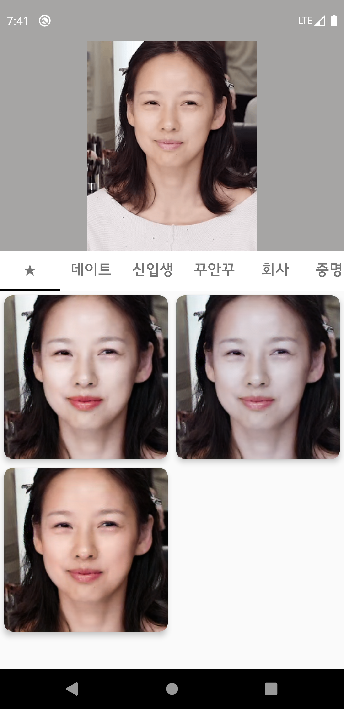
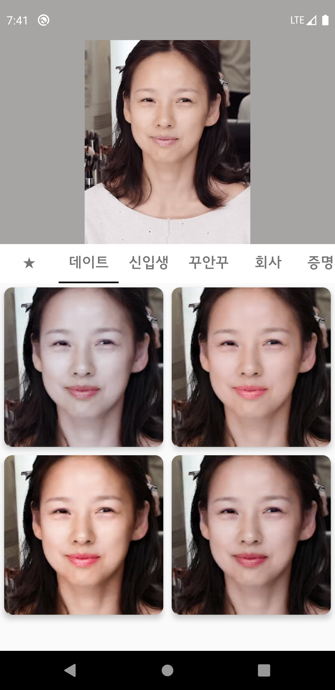
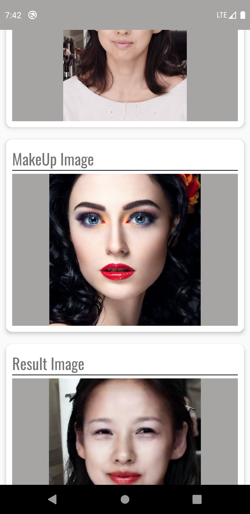
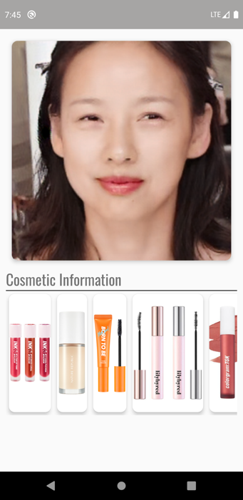
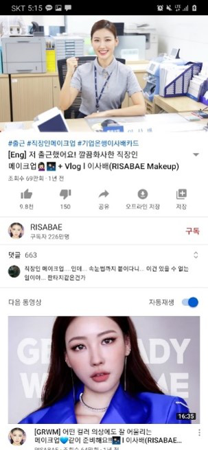
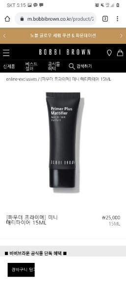

# WannaB-Android
### Android AI 화장 추천 어플
사람마다 피부톤, 얼굴형, 개성 등 맞는 화장법은 다양합니다. 그렇기 때문에 자신에게 맞는 화장법을 찾기 어렵고 오랜 시간과 다양한 화장품을 사용하면서 자신에게 맞는 화장법을 찾습니다.
저희 어플은 다양한 화장 데이터와 인공지능을 활용하여 미리 화장된 사진을 만듭니다. 사용자는 만들어진 사진을 바탕으로 자신에게 맞는 화장법을 쉽게 찾을 수 있고, 화장 영상과, 화장품 정보를 통해 쉽게 따라할 수 있습니다.

## 😊 Introduction
### Server WannaB 
핸드폰에 저장된 본인의 사진을 선택하면 서버에 저장된 화장 데이터를 통해 여러가지 화장이 적용된 이미지를 볼 수 있습니다.

### Local WannaB
본인의 사진과 본인이 원하는 화장된 이미지를 선택하여 화장이 적용된 이미지를 볼 수 있습니다.

### Result WannaB
화장된 결과, 화장품 정보, 화장 방법을 상세하게 볼 수 있습니다.

## 📜 AI Model
### BeautyGan
#### https://github.com/Honlan/BeautyGAN
GAN Model로 학습된 BeautyGan을 통해 가상의 메이크업 이미지를 만들었습니다. 사용자의 편의를 고려하여 이미지 밝기 조절, 수평화 작업등 추가적인 모델을 만들었습니다.

## 📱 Android
* Glide : 서버로 받은 Image를 표현하기 위해 사용.
* Volley : 비동기 형태로 서버와 통신하기 위해 사용.
* Room : Local Storage를 통해, 캐쉬, 즐겨찾기 기능등 활용.

#### AI Model 및 시연 연상
https://drive.google.com/drive/folders/1aSo2o29CFO9BRKPGkGdHel_8XGTA12wx?usp=sharing